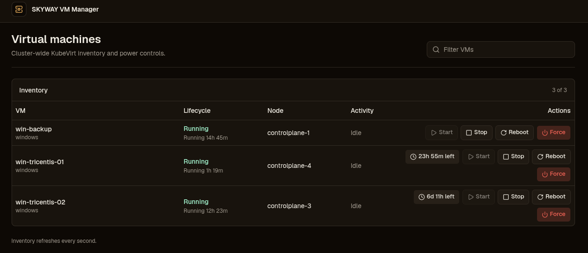
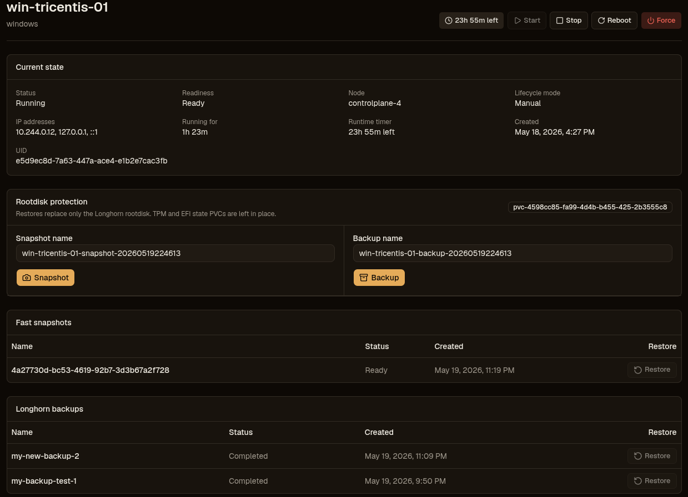

# SKYWAY VM Manager

Dark-only KubeVirt control GUI for SKYWAY virtual machines.

The app has no built-in authentication and contains no secrets. Production access is expected to be enforced in front of the service by company Pangolin SSO.

## Features

- Lists KubeVirt `VirtualMachine` resources across all namespaces.
- Shows power state, `printableStatus`, readiness, node, IP addresses, run strategy, and active storage operations.
- Supports start, graceful stop, reboot, and force stop through the KubeVirt subresource API.
- Enforces Manual VM runtime timers with resettable 1-7 day and 30-day durations.
- Supports custom-named Longhorn rootdisk snapshots and backups.
- Shows fast Longhorn snapshots and Longhorn backups separately, including recurring backups.
- Restores only the VM `rootdisk` Longhorn volume. KubeVirt `persistent-state-for-*` TPM/EFI PVCs are preserved as-is.
- Keeps the previous rootdisk PV/Longhorn volume as rollback storage for 24 hours after backup restore, with an admin discard action.
- Hides VMs labelled or annotated with `vm-manager.skyway.tools/managed=false`.

## Screenshots





## Kubernetes Access

The server uses Kubernetes API credentials in this order:

1. In-cluster ServiceAccount credentials when `KUBERNETES_SERVICE_HOST` is present.
2. Local kubeconfig via `KUBECONFIG` or the default kubeconfig search path for development.

The app never shells out to `kubectl` or `virtctl`.

## Longhorn Access

Set `LONGHORN_API_URL` when the Longhorn backend is not reachable at the in-cluster default:

```text
http://longhorn-backend.longhorn-system.svc:9500/v1
```

## Development

```bash
pnpm install
portless vm-manager pnpm dev
```

Open `http://vm-manager.localhost:1355` when Portless falls back to its non-privileged proxy port.

## Checks

```bash
pnpm lint
pnpm typecheck
pnpm test
pnpm build
gitleaks detect
```

## Image

Release workflow publishes:

```text
ghcr.io/skyway-gmbh/vm-manager
```
